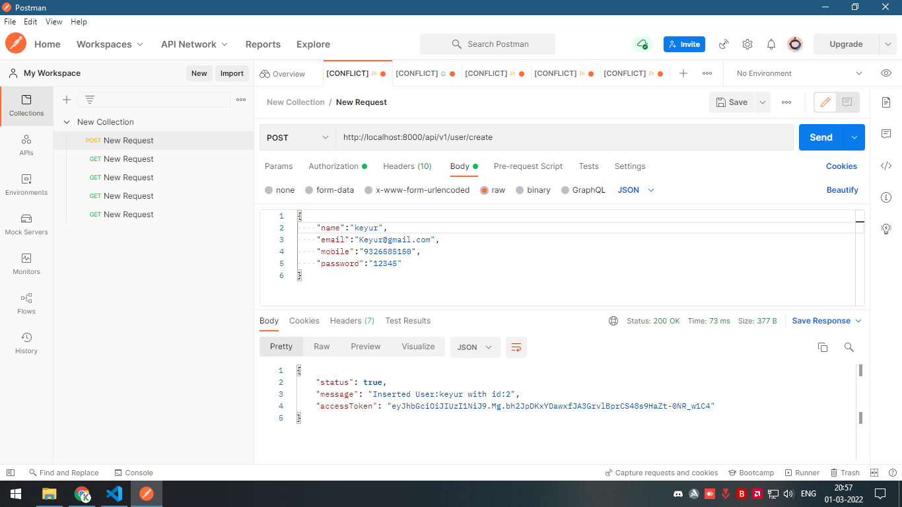
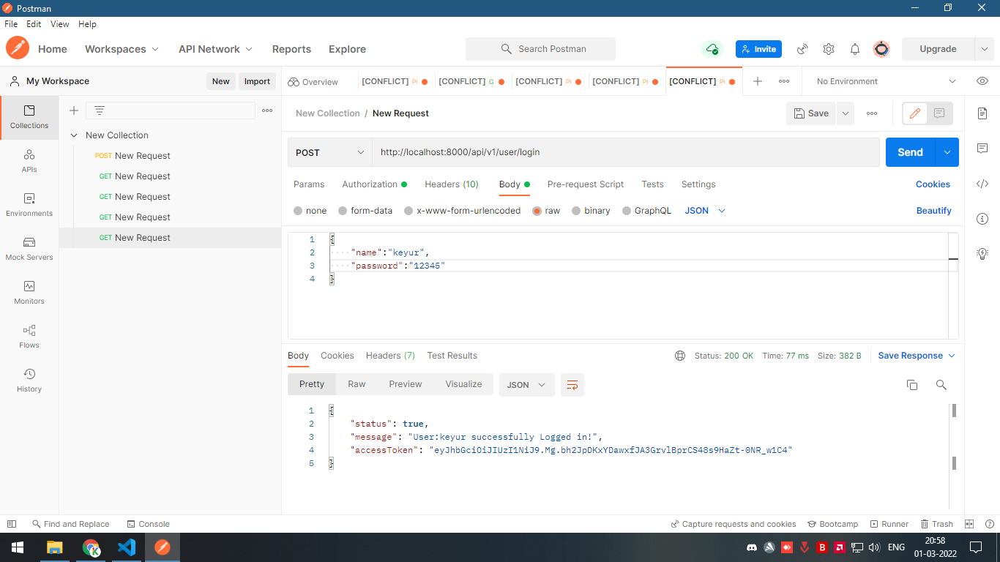
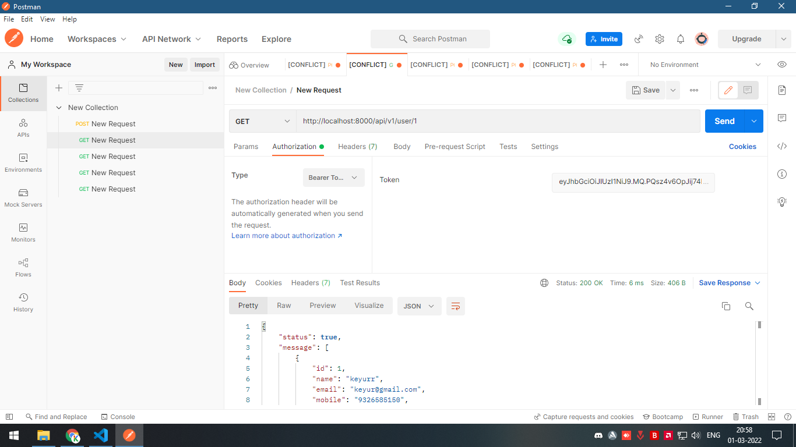
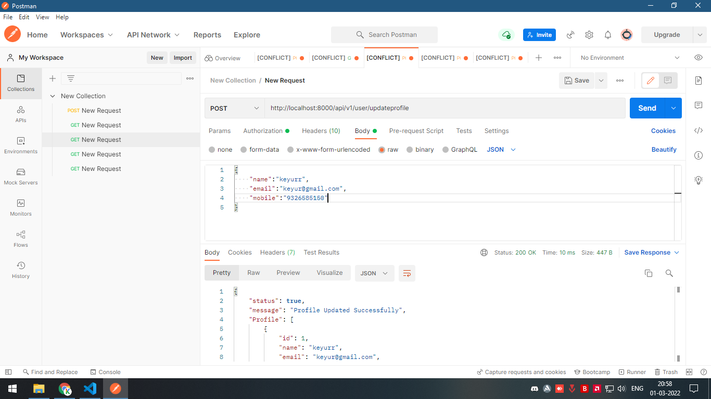
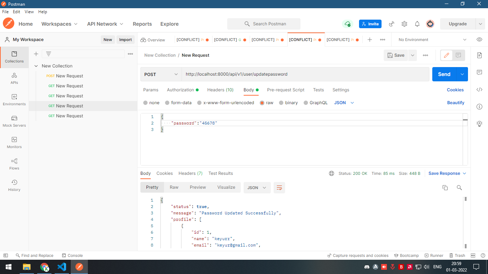

To Test the Application use postman.
Authorization used is Bearer token.After registering or logging in,a bearer token is displayed,use that for authorization.

The routes are as follows-
### Register User
http://localhost:8000/api/v1/user/create  

### Login User
http://localhost:8000/api/v1/user/login 

### Get All Users
http://localhost:8000/api/v1/user        

### Get profile of a specific user
http://localhost:8000/api/v1/user/id      

### Get your own profile
http://localhost:8000/api/v1/user/profile/self 

### Update your profile
http://localhost:8000/api/v1/user/updateprofile  

### Update your password
http://localhost:8000/api/v1/user/updatepassword  
